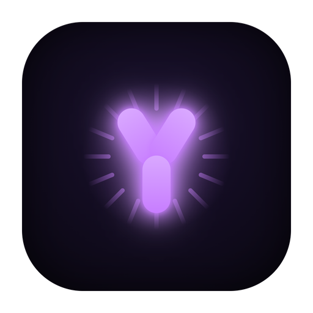
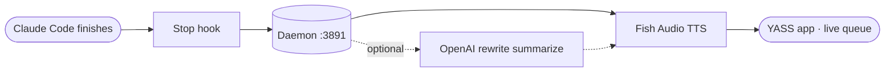

<div align="center">



# YASS

**Your AI Speaking System**. Gives your coding agents a voice.

When [Claude Code](https://docs.anthropic.com/en/docs/claude-code) finishes a task, YASS **speaks the result out loud**: visual queue, personas, and quality TTS. Runs on your machine (audio is synthesized via the Fish Audio API).

[](LICENSE)
[](https://docs.anthropic.com/en/docs/claude-code)

[Contributing](CONTRIBUTING.md) · [Releases](https://github.com/pedruino/yass/releases)

</div>

---

## What it is

A desktop app (Tauri) plus a local daemon (Node) that turn an agent's last response into speech. The daemon synthesizes; the window plays. Your text stays on your machine except the Fish Audio synthesis call (and the optional OpenAI rewrite), so a Fish Audio account and key are required.



The Stop hook is `hooks/speak-hook.js` (source install) or the app's built-in `--hook` mode.

## Prerequisites

- macOS, Windows, or Linux (desktop app via Tauri; installers for all three are built in CI)
- Node.js >= 20
- [Fish Audio](https://fish.audio) key (TTS): **required**
- Optional: OpenAI key (rewrites the text before speaking)

## Getting started

```bash
git clone https://github.com/pedruino/yass.git
cd yass
cp .env.example .env          # fill in FISH_API_KEY (or configure via the Settings panel)
npm install
cd app && npm install && npm run build && cd ..
node yass-daemon.js           # dev: daemon + app at http://localhost:3891
```

Packaged app (native window):

```bash
cd app && ./node_modules/.bin/tauri build   # builds YASS.app
```

Install into Claude Code (speak hook on Stop):

```bash
./install.sh
touch ~/.yass/speak-mode                        # enables speech
claude mcp add yass node ~/.claude/mcp-servers/speak/index.js
```

## Configuration (BYOK)

Open **Settings** in the app, paste the Fish key (and OpenAI, optional). It applies **instantly, no restart**. Or edit the root `.env`. Both write to the same place; the key never reaches the browser.

| Key | Use | Required |
|-------|-----|-------------|
| `FISH_API_KEY` | Fish Audio TTS (`api.fish.audio`) | **Yes** |
| `FISH_VOICE_ID` | voice id (has a default) | No |
| `OPENAI_API_KEY` | rewrites the text before speaking (gpt-4o-mini) | No |
| `PORT` | daemon port (3891) | No |

**Personas** (`config/personas.json`): prompt + emotion presets (Jarvis, Pumba, Narrator, Hype). **Voices**: your Fish voices plus public library search, straight from the panel.

## Structure

```text
yass/
├── yass-daemon.js         # HTTP+SSE daemon (:3891): queue, Fish TTS, OpenAI rewrite, /config, /quick-phrases
├── yass-enqueue.js        # standalone CLI helper: POSTs a text to /enqueue (auto-launches the daemon)
├── speak-cli.js           # speaks a phrase directly from the command line
├── index.js               # "speak" MCP server (registers the tool in Claude Code)
├── install.sh             # source installer: symlinks daemon/hook/MCP into ~/.claude
├── glossary.json          # pronunciation dictionary (term -> how to say it), applied before TTS
├── .env.example           # key template (FISH_API_KEY etc); copy to .env
├── config/
│   ├── personas.json      # persona presets (prompt + emotion): Jarvis, Pumba, Narrator, Hype
│   └── work-config.example.json  # work schedule/context template (optional)
├── hooks/
│   └── speak-hook.js      # Node Stop hook: POSTs each Claude Code response to /enqueue (the app also has a built-in --hook)
├── docs/                  # prototypes and specs (waveform, icon, Tauri spike)
├── .github/
│   ├── workflows/build.yml    # CI: builds installers for all 3 OSes; a v* tag publishes a Release
│   ├── ISSUE_TEMPLATE/        # bug and idea templates
│   └── pull_request_template.md
└── app/                # frontend + desktop shell
    ├── src/               # React app (Widget.tsx, components/, lib/, index.css with tokens)
    ├── src-tauri/         # Tauri shell (Rust): window, daemon sidecar, icons, capabilities
    ├── design.html        # design system showcase
    └── vite.config.ts     # Vite build -> app/dist (served by the daemon in dev)
```

## Stack

Node (daemon) · React · Vite · Tailwind v4 · shadcn/ui · Tauri · Fish Audio · OpenAI (optional) · MCP · SSE.

## License

[MIT](LICENSE) © Pedro Escobar
